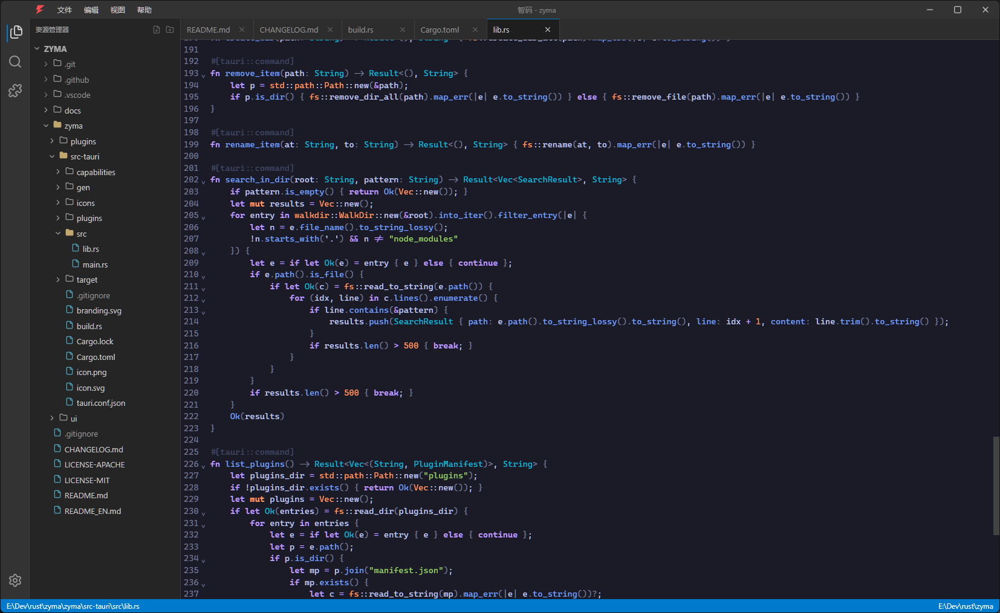
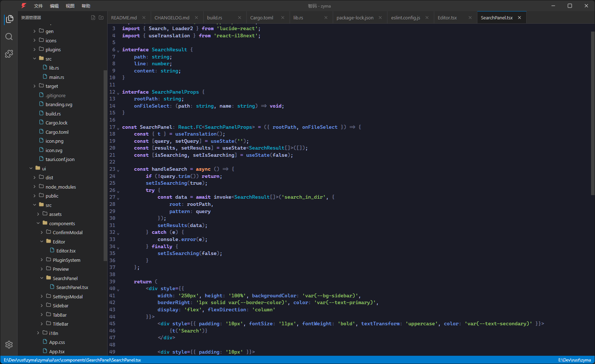
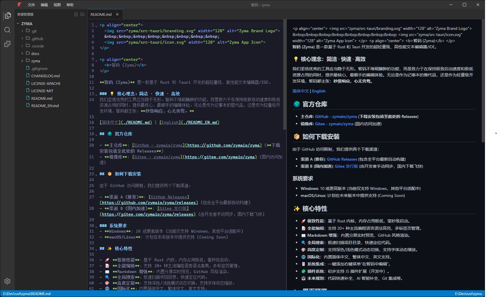
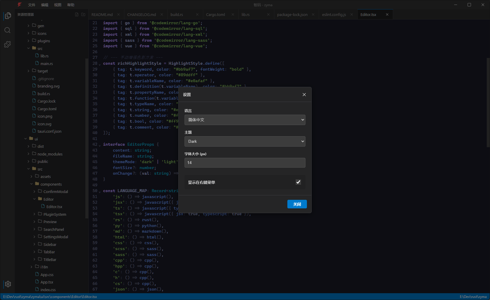

<p align="center">
  
  &nbsp;&nbsp;&nbsp;&nbsp;&nbsp;&nbsp;&nbsp;&nbsp;
  
</p>

<p align="center">
  <b>Zyma</b>
</p>

**Zyma** is an ultra-lightweight, high-performance text editor/IDE built with Rust and Tauri.

### 💡 Philosophy: Simple · Fast · Efficient
We believe that great tools should be invisible. Zyma focuses on providing a distraction-free editing experience with millisecond startup times and minimal resource footprint. Whether used as a Notepad replacement or a lightweight coding environment, Zyma stands for: **Instant Response, Total Focus.**

[简体中文](./README.md) | [English](./README_EN.md)

## 🌍 Repositories

- **Primary**: [GitHub - zymaio/zyma](https://github.com/zymaio/zyma) (Actions, Releases)
- **Mirror**: [Gitee - zymaio/zyma](https://gitee.com/zymaio/zyma) (Fast access in China)

## ✨ Core Features

- 🚀 **Extreme Performance**: Built on a Rust core with minimal memory footprint and millisecond-level startup.
- 📝 **Versatile Editing**: Built-in syntax highlighting for 20+ mainstream programming languages and multi-tab management.
- 📖 **Markdown Enhanced**: Real-time side-by-side preview with GitHub-style rendering.
- 🔍 **Global Search**: Instant full-project text scanning with jump-to-file capability.
- 🎨 **Highly Customizable**: Dynamic switching between Dark and Light modes, plus real-time font scaling.
- 🌐 **Internationalization**: Built-in support for Simplified Chinese, Traditional Chinese, and English.
- 🖱️ **System Integration**: One-click context menu integration ("Edit with Zyma").
- 🧩 **Plugin System**: Basic JS-based extension engine (In development).
- 🤖 **Upcoming**: Code auto-completion, AI-powered coding assistant, Git integration.

## 📸 Screenshots

### 🚀 Core Editing Experience (Rust & TypeScript)
Supports syntax highlighting for 20+ languages with millisecond response times.

<p align="center">
  
  &nbsp;
  
</p>

### 📖 Markdown Real-time Preview
Built-in split-view preview with GitHub-style rendering.

<p align="center">
  
</p>

### 🎨 Theme & Settings
Dynamic switching between Dark and Light modes, with persistent configurations.

<p align="center">
  
</p>

## 🛠️ Tech Stack

- **Core**: Rust + Tauri v2
- **Frontend**: React + TypeScript + Vite
- **Editor**: CodeMirror 6
- **Icons**: Lucide React

## 📦 How to Build

### Prerequisites
- **Windows**: 10 or higher (Currently Windows only)
- **macOS/Linux**: Planned for future releases (Coming Soon)

### Steps
1. Clone the repository
   ```bash
   git clone https://github.com/zymaio/zyma.git
   cd zyma
   ```
2. Install frontend dependencies
   ```bash
   cd ui
   npm install
   cd ..
   ```
3. Run development version
   ```bash
   cargo tauri dev
   ```
4. Build for release
   ```bash
   cargo tauri build
   ```

## 📄 License

This project is dual-licensed under **MIT OR Apache-2.0**.
- **Core Code**: Licensed under MIT or Apache-2.0.
- **Brand Assets**: The Zyma Lightning Bolt logo is an original artwork owned by Zyma Contributors and is licensed for use within this project and its derivatives.
- **Plugins**: Closed-source development is permitted.

---

## 🤝 Contributing

Issues and Pull Requests are welcome! We look forward to your suggestions.
